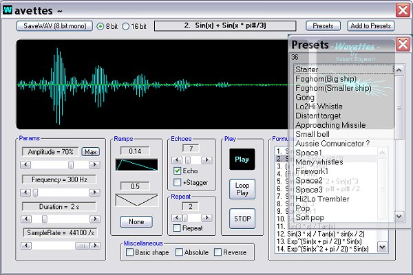



## Wavettes\(Update 31 May\)\)

### Description

~Wavettes~ by Robert Rayment. Designer for short WAVs using some maths formulae and a range of settings. Screenshot shows the settings. There are 3 dozen Presets (from the millions) to show the idea. These can be added to, from the program, and are saved in Presets.txt in the same folder. So can be easily editted with Notepad or whatever. WAVs can be saved as 8 or 16 bit mono, though there is usually not much difference. Some code is adapted from Ulli's prog at (CodeId=64845) and a UC container from Eric Madison at (CodeId=40130) is used. Making noisy WAVs is not to everyones's taste but I found it quite amusing and perhaps some of you will too! Zip 164 KB.

----

Update (4th May) Compiles now with no advanced optimization. Seems to avoid a crash when exitting the exe on at least one system. One report I've had suggests that 'buzz' on headphones might be due to a Windows setting for volume or audio properties.

----

Update (10th may) Behaviour of Play button modified to act more like normal button &amp; some typos.

----

Update (29th May) Replaced Play button with normal button.

----

(31st May) Carles spotted an article in vbaccelerator.com which explains the real reason for 'crashes at shutdown' for some PCs when using XP themes with VB6. The URL is rather long so go to vbaccelerator.com, select VB section and search 'crashes at shutdown'. I haven't modified this code but you can try it if you want to. Otherwise simply delete the manifest file.

----

Update (31st May) VBAccelerator code (see above) now included.
 
### More Info
 
Just run

WAVs

             |
---                |---
**Submitted On**   |2006-05-10 08:34:40
**By**             |[Robert Rayment](https://github.com/Planet-Source-Code/PSCIndex/blob/master/ByAuthor/robert-rayment.md)
**Level**          |Intermediate
**User Rating**    |5.0 (225 globes from 45 users)
**Compatibility**  |VB 6\.0
**Category**       |[Sound/MP3](https://github.com/Planet-Source-Code/PSCIndex/blob/master/ByCategory/sound-mp3__1-45.md)
**World**          |[Visual Basic](https://github.com/Planet-Source-Code/PSCIndex/blob/master/ByWorld/visual-basic.md)
**Archive File**   |[Wavettes\(U1997835312006\.zip](https://github.com/Planet-Source-Code/robert-rayment-wavettes-update-31-may__1-65169/archive/master.zip)

### API Declarations

A few

